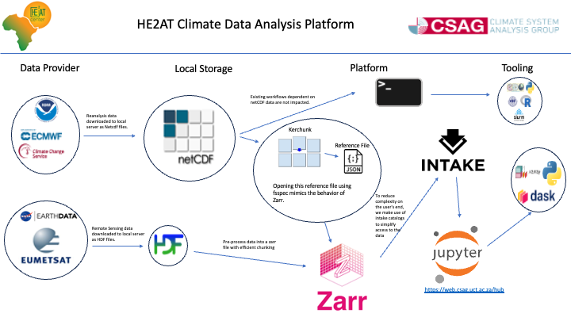

# Example Notebooks

A collection of Jupyter Notebooks demonstrating the data and tools available on the CSAG Jupyter Hub. 

For these to work you will need to symlink the Heat Center project directory to your home folder. If everybody does this we will be able to share direct links to notebooks to aid collaboration. 

Step 1) Navigate to https://web.csag.uct.ac.za/hub and log in using your credentials. 

step 2) Open a new launcher. By navigating to File > New Launcher

step 3) Open a terminal window. 

step 4) copy and paste the following code into the terminal. 
```
cd  
ln -s /terra/projects/heat_center/
```

From here you can access the code and data in the heat center directory from the terminal or the jupyterlab file browser. 

Please avoid running example code in the project directory as this will overwrite the contents. To run the notebooks please copy them to your home directory. 

You can do this by running the following code:
```
cd 
mkdir my_example_notebooks
cp -r heat_center/code/example_notebooks/ my_example_notebooks/.
```

All example notebooks have been run using the `pangeo` conda enviroment. 


### As the JupyterHub is a shared resource it is important that you kill all processes before logging off. This can be done by accessing the 'stop' tab on the sidebar and clicking shutdown all on the Kernels listing. 




